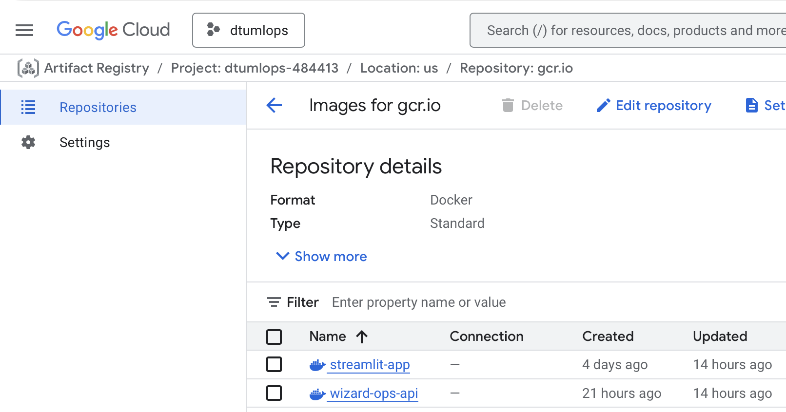

# Project description: Nutrition Predictor

The overall goal of the project is to train a neural network (NN) model that can predict the nutritional value of a plate of food based on an image of the plate.

The overall goal of the project is to train a model that can predict the
nutritional value of a plate of food based on an image of the plate.

The model is trained on a subset of the
[Nutrition5k dataset](https://github.com/google-research-datasets/Nutrition5k?tab=readme-ov-file)
containing
[side angle images](https://www.kaggle.com/datasets/zygmuntyt/nutrition5k-dataset-side-angle-images/data).
The kaggle dataset contains 20 samples per plate of food: four cameras, out of
which were extracted five consecutive frames. We will use only one of
these angles per plate (configurable via Hydra).

After processing, our dataset will contain a single image of 5000 different
dishes and metadata for each dish corresponding to 0.6GB of (uncompressed) data.
The images are JPEGs, and the metadata a CSV containing the total calories, mass,
fat, carb and protein associated with each dish ID.

We use ResNet18 as backbone, and we adapt it for regression by replacing the
final classification layer with a small FF network that outputs the nutritional
values. The pretrained backbone serves as a feature extractor, with its weights
frozen during training while the regression head is learned. This architecture
follows approaches we have commonly seen in Kaggle notebooks for the Nutrition5k
dataset. While published work has employed larger models like InceptionV2 and
ResNet50/101 ([Thames et al., 2021](https://arxiv.org/abs/2103.03375)), ResNet18
is a reasonable choice for purposes not focused on prediction accuracy.

# Exam template for 02476 Machine Learning Operations

This is the report template for the exam. Please only remove the text formatted as with three dashes in front and behind
like:

`--- question 1 fill here ---`

Where you instead should add your answers. Any other changes may have unwanted consequences when your report is
auto-generated at the end of the course. For questions where you are asked to include images, start by adding the image
to the `figures` subfolder (please only use `.png`, `.jpg` or `.jpeg`) and then add the following code in your answer:

``

In addition to this markdown file, we also provide the `report.py` script that provides two utility functions:

Running:

```bash
python report.py html
```

Will generate a `.html` page of your report. After the deadline for answering this template, we will auto-scrape
everything in this `reports` folder and then use this utility to generate a `.html` page that will be your serve
as your final hand-in.

Running

```bash
python report.py check
```

Will check your answers in this template against the constraints listed for each question e.g. is your answer too
short, too long, or have you included an image when asked. For both functions to work you mustn't rename anything.
The script has two dependencies that can be installed with

```bash
pip install typer markdown
```

or

```bash
uv add typer markdown
```

## Overall project checklist

The checklist is _exhaustive_ which means that it includes everything that you could do on the project included in the
curriculum in this course. Therefore, we do not expect at all that you have checked all boxes at the end of the project.
The parenthesis at the end indicates what module the bullet point is related to. Please be honest in your answers, we
will check the repositories and the code to verify your answers.

### Week 1

- [x] Create a git repository (M5)
- [x] Make sure that all team members have write access to the GitHub repository (M5)
- [x] Create a dedicated environment for you project to keep track of your packages (M2)
- [x] Create the initial file structure using cookiecutter with an appropriate template (M6)
- [x] Fill out the `data.py` file such that it downloads whatever data you need and preprocesses it (if necessary) (M6)
- [x] Add a model to `model.py` and a training procedure to `train.py` and get that running (M6)
- [x] Remember to fill out the `requirements.txt` and `requirements_dev.txt` file with whatever dependencies that you
      are using (M2+M6)
- [x] Remember to comply with good coding practices (`pep8`) while doing the project (M7)
- [x] Do a bit of code typing and remember to document essential parts of your code (M7)
- [x] Setup version control for your data or part of your data (M8)
- [x] Add command line interfaces and project commands to your code where it makes sense (M9)
- [x] Construct one or multiple docker files for your code (M10)
- [x] Build the docker files locally and make sure they work as intended (M10)
- [x] Write one or multiple configurations files for your experiments (M11)
- [x] Used Hydra to load the configurations and manage your hyperparameters (M11)
- [ ] Use profiling to optimize your code (M12)
- [x] Use logging to log important events in your code (M14)
- [x] Use Weights & Biases to log training progress and other important metrics/artifacts in your code (M14)
- [ ] Consider running a hyperparameter optimization sweep (M14)
- [x] Use PyTorch-lightning (if applicable) to reduce the amount of boilerplate in your code (M15)

### Week 2

- [x] Write unit tests related to the data part of your code (M16)
- [x] Write unit tests related to model construction and or model training (M16)
- [x] Calculate the code coverage (M16)
- [x] Get some continuous integration running on the GitHub repository (M17)
- [x] Add caching and multi-os/python/pytorch testing to your continuous integration (M17)
- [x] Add a linting step to your continuous integration (M17)
- [x] Add pre-commit hooks to your version control setup (M18)
- [ ] Add a continues workflow that triggers when data changes (M19)
- [ ] Add a continues workflow that triggers when changes to the model registry is made (M19)
- [x] Create a data storage in GCP Bucket for your data and link this with your data version control setup (M21)
- [x] Create a trigger workflow for automatically building your docker images (M21)
- [x] Get your model training in GCP using either the Engine or Vertex AI (M21)
- [x] Create a FastAPI application that can do inference using your model (M22)
- [x] Deploy your model in GCP using either Functions or Run as the backend (M23)
- [x] Write API tests for your application and set up continuous integration for these (M24)
- [x] Load test your application (M24)
- [x] Create a more specialized ML-deployment API using either ONNX or BentoML, or both (M25)
- [x] Create a frontend for your API (M26)

### Week 3

- [ ] Check how robust your model is towards data drifting (M27)
- [ ] Deploy to the cloud a drift detection API (M27)
- [ ] Instrument your API with a couple of system metrics (M28)
- [x] Setup cloud monitoring of your instrumented application (M28)
- [x] Create one or more alert systems in GCP to alert you if your app is not behaving correctly (M28)
- [x] If applicable, optimize the performance of your data loading using distributed data loading (M29)
- [x] If applicable, optimize the performance of your training pipeline by using distributed training (M30)
- [ ] Play around with quantization, compilation and pruning for you trained models to increase inference speed (M31)

### Extra

- [ ] Write some documentation for your application (M32)
- [ ] Publish the documentation to GitHub Pages (M32)
- [ ] Revisit your initial project description. Did the project turn out as you wanted?
- [ ] Create an architectural diagram over your MLOps pipeline
- [x] Make sure all group members have an understanding about all parts of the project
- [x] Uploaded all your code to GitHub.

## Group information

### Question 1

> **Enter the group number you signed up on <learn.inside.dtu.dk>**
>
> Answer:

Team 33

### Question 2

> **Enter the study number for each member in the group**
>
> Answer:

s253471, s253033, s253081, johco (s223190), alihaj (s242522)

### Question 3

> **A requirement to the project is that you include a third-party package not covered in the course. What framework**
> **did you choose to work with and did it help you complete the project?**
>
> Recommended answer length: 100-200 words.
>
> Example:
> _We used the third-party framework ... in our project. We used functionality ... and functionality ... from the_
> _package to do ... and ... in our project_.
>
> Answer:

The library we've used in our project is Albumations
(https://pypi.org/project/albumentations/). It is a library commonly used in Computer Vision applications to derive new samples for training higher quality models. We used it to apply transformations to our input images such as resizing and normalizing. We utilized Albuminations over the course's used torchvision or cv2 libraries, as this library's pipelines provide a unified interface that simultaneously transforms images and their associated metadata (in our case, dish images and the ground truth metadata about their nutritional value).

## Coding environment

> In the following section we are interested in learning more about you local development environment. This includes
> how you managed dependencies, the structure of your code and how you managed code quality.

### Question 4

> **Explain how you managed dependencies in your project? Explain the process a new team member would have to go**
> **through to get an exact copy of your environment.**
>
> Recommended answer length: 100-200 words
>
> Example:
> _We used ... for managing our dependencies. The list of dependencies was auto-generated using ... . To get a_
> _complete copy of our development environment, one would have to run the following commands_
>
> Answer:

We used `uv` for managing our dependencies. We structured the project as a
workspace in the root `pyproject.toml`, with the two sub-projects `frontend` and
`backend` (under the `src/` folder) each having their own `pyproject.toml`).

To get a complete copy of the development environment, it is sufficient to run

```bash
uv sync --all-packages
```

in the root of the repository.

We chose to omit the `uv.lock` file from being permanently stored in the root directory, as it forces the environment to resolve dependencies dynamically, which ensures the project stays synchronized with the latest updates and prevents dependency issues.

### Question 5

> **We expect that you initialized your project using the cookiecutter template. Explain the overall structure of your**
> **code. What did you fill out? Did you deviate from the template in some way?**
>
> Recommended answer length: 100-200 words
>
> Example:
> _From the cookiecutter template we have filled out the ... , ... and ... folder. We have removed the ... folder_
> _because we did not use any ... in our project. We have added an ... folder that contains ... for running our_
> _experiments._
>
> Answer:

From the cookiecutter template we have filled out the `src`, `tests`, `configs`
and `dockerfiles` folders. We kept unmodified the folders `scripts` and
`reports` (except for filling out the report itself). We have removed the `data` and `notebooks` folders as their purpose is fulfilled by the DVC setup and python scripts for executing training/evaluation pipeline, respectively.

We have added a `.devcontainer` folder that contains the configuration files for
setting up a development container in VSCode and other supported IDEs. We have
also added a `.dvc` folder for data version control.

We did not add multiple experiments to the Hydra `configs` folder, we have only
our main configuration file.

### Question 6

> **Did you implement any rules for code quality and format? What about typing and documentation? Additionally,**
> **explain with your own words why these concepts matters in larger projects.**
>
> Recommended answer length: 100-200 words.
>
> Example:
> _We used ... for linting and ... for formatting. We also used ... for typing and ... for documentation. These_
> _concepts are important in larger projects because ... . For example, typing ..._
>
> Answer:

We agreed verbally on using typing as much as possible in our codebase, where it
does not impede readability or ease of development. We used `ruff` for linting
and defined its rules in the `pyproject.toml` file. We have also added a linting
check step to our CI pipeline to ensure that all code merged to the main branch
follows the defined rules.

These concepts are important in larger projects because they help maintain code
quality and readability, and facilitate collaboration among team members. Typing
for example serves as additional documentation for communicating the inputs,
purpose and outputs of functions, classes and class members, facilitating
therefore collaboration across team members assigned to different tasks. It also
helps catch potential bugs early in the development process.

## Version control

> In the following section we are interested in how version control was used in your project during development to
> corporate and increase the quality of your code.

### Question 7

> **How many tests did you implement and what are they testing in your code?**
>
> Recommended answer length: 50-100 words.
>
> Example:
> _In total we have implemented X tests. Primarily we are testing ... and ... as these the most critical parts of our_
> _application but also ... ._
>
> Answer:

In total we have implemented 27 tests. We kept the original structure of the
`tests` folder, and we are equally testing data processing, model evaluation,
the model class functionality itself, and the training processes. Naturally,
we mocked the expensive operations to ensure fast runs of testing which need not
be tested anyway.

### Question 8

> **What is the total code coverage (in percentage) of your code? If your code had a code coverage of 100% (or close**
> **to), would you still trust it to be error free? Explain you reasoning.**
>
> Recommended answer length: 100-200 words.
>
> Example:
> *The total code coverage of code is X%, which includes all our source code. We are far from 100% coverage of our \*\*
> *code and even if we were then...\*
>
> Answer:

The total code coverage at time of writing is 42%. At time of writing, we did
not exclude any files from the coverage criterion.

Even with code coverage of 100%, we wouldn't expect it to be completely error
free as code coverage merely measures the lines of code that were executed over
the total number. However, combined scenarios of different things executing one
after the other could still cause bugs, particularly in stateful applications.

### Question 9

> **Did you workflow include using branches and pull requests? If yes, explain how. If not, explain how branches and**
> **pull request can help improve version control.**
>
> Recommended answer length: 100-200 words.
>
> Example:
> _We made use of both branches and PRs in our project. In our group, each member had an branch that they worked on in_
> _addition to the main branch. To merge code we ..._
>
> Answer:

Yes, we have made use of both branches and PRs in our project. Every week when
we met, we discuss the current status of tasks and overall progress, then get on
to assigning what's left to do to each member. Each member then creates a branch
that refers to one or more interrelated tasks that they were assigned, and
creates a pull request when they are done.

The pull request is then reviewed by at least one other member, who can chime in
with comments or suggestions on things the original author might have missed.

While doing so, the reviewer can also understand what was done, which can
potentially help them in their own tasks.

### Question 10

> **Did you use DVC for managing data in your project? If yes, then how did it improve your project to have version**
> **control of your data. If no, explain a case where it would be beneficial to have version control of your data.**
>
> Recommended answer length: 100-200 words.
>
> Example:
> _We did make use of DVC in the following way: ... . In the end it helped us in ... for controlling ... part of our_
> _pipeline_
>
> Answer:

Yes we used DVC with Google buckets. As we started using this we came to a conclusion that DVC is very good to do developments locally or share the projects between other members, but it is definitely not a solution for automated production pipelines. This comes from our experiments with setting up cloud builds as trying to automate the training phase however DVC has many compatibility issues when it comes to containerising.

### Question 11

> **Discuss you continuous integration setup. What kind of continuous integration are you running (unittesting,**
> **linting, etc.)? Do you test multiple operating systems, Python version etc. Do you make use of caching? Feel free**
> **to insert a link to one of your GitHub actions workflow.**
>
> Recommended answer length: 200-300 words.
>
> Example:
> _We have organized our continuous integration into 3 separate files: one for doing ..., one for running ... testing_
> _and one for running ... . In particular for our ..., we used ... .An example of a triggered workflow can be seen_
> _here: <weblink>_
>
> Answer:

We have organized our continuous integration into 2 files -- 1) for linting and 2) testing.

In the linting workflow we checkout the code, install the dependencies and run a check with `ruff`.
In the testing workflow we checkout the code, install the dependencies and run `pytest` with coverage.

We make use of cache, storing contents of ~/.cache/uv, ~/.local/share/uv/python, .venv from the runner to save
having to download the same dependencies on every run, when they don't change across most runs.

Initially our setup was building on GitHub Actions and deploying to Google Cloud, later building and deploying, however,
the latest revision work definition is also on Google Cloud. This makes it more difficult to reason about work definitions,
having workflow configurations on GitHub AND Google. Using GitHub CI/CD would make it rather simple to cache Docker layers as well,
reducing time spent building.

We do not test multiple operating systems and Python versions in the interest of performance and faster feedback cycles,
we only test one OS = Linux, where our code runs, and the Python version we use = 3.12. That said,
running tests for different OSs and Python versions in parallel should not only give us confidence
on compatibility with different versions, but also accomplish our goal of fast feedback cycles.

The testing workflow file is available here https://github.com/iarata/wizard-ops/blob/main/.github/workflows/tests.yaml

## Running code and tracking experiments

> In the following section we are interested in learning more about the experimental setup for running your code and
> especially the reproducibility of your experiments.

### Question 12

> **How did you configure experiments? Did you make use of config files? Explain with coding examples of how you would**
> **run a experiment.**
>
> Recommended answer length: 50-100 words.
>
> Example:
> _We used a simple argparser, that worked in the following way: Python my_script.py --lr 1e-3 --batch_size 25_
>
> Answer:

We used Hydra config files `(configs/config.yaml)` to define all our data, model, and training hyperparameters. To run an experiment, use the package’s CLI and pass needed Hydra commands. For example, by executing on terminal: `uv run wizard_ops train model.backbone=resnet50 train.max_epochs=20 train.fast_dev_run=false` would kick off a full training run and produce checkpoints and logs on W&B's.

### Question 13

> **Reproducibility of experiments are important. Related to the last question, how did you secure that no information**
> **is lost when running experiments and that your experiments are reproducible?**
>
> Recommended answer length: 100-200 words.
>
> Example:
> _We made use of config files. Whenever an experiment is run the following happens: ... . To reproduce an experiment_
> _one would have to do ..._
>
> Answer:

We set this mainly by using a fixed seed setted via `lightning.seed_everything()` function. Additionally, it was made sure that the workers seeds for the dataset loaders are also set properly. Furthermore, In addition, the W&B is keeping track of all the parameters and one can reproduce the same experiment by either pulling the configs from W&B or just sharing a config file.

### Question 14

> **Upload 1 to 3 screenshots that show the experiments that you have done in W&B (or another experiment tracking**
> **service of your choice). This may include loss graphs, logged images, hyperparameter sweeps etc. You can take**
> **inspiration from [this figure](figures/wandb.png). Explain what metrics you are tracking and why they are**
> **important.**
>
> Recommended answer length: 200-300 words + 1 to 3 screenshots.
>
> Example:
> _As seen in the first image when have tracked ... and ... which both inform us about ... in our experiments._
> _As seen in the second image we are also tracking ... and ..._
>
> Answer:


We are tracking the MSE loss along with logging some validation set's samples to compare the predictions with GT.

### Question 15

> **Docker is an important tool for creating containerized applications. Explain how you used docker in your**
> **experiments/project? Include how you would run your docker images and include a link to one of your docker files.**
>
> Recommended answer length: 100-200 words.
>
> Example:
> _For our project we developed several images: one for training, inference and deployment. For example to run the_
> _training docker image: `docker run trainer:latest lr=1e-3 batch_size=64`. Link to docker file: <weblink>_
>
> Answer:

<<<<<<< Updated upstream
We containerized training process, as well as both backend and frontend; these Dockerfiles live in `dockerfiles/api.dockerfile` and `dockerfiles/frontend.dockerfile`. For CI/CD we build images using Google Cloud Build and push them to Artifact Registry, then deploy to Cloud Run, and integrate it with our cloud triggers. For example, for building and pushing a docker image of our train Dockerfile to Artifact Registry, you could run a command: `gcloud builds submit --project="$PROJECT" --config=cloudbuild-train.yaml  .`
=======
We did mainly two experiments with containers. One idea was to make docker image for every aspect of this project, that is an image for backend, an image for frontend and an image for training. As it was mentioned making containers with the training directly caused many issues with DVC. Another way we tried was to only make an image of our project. Since our project is an executable is some way (one can run `uv run wizard_ops --help` or `wizard_ops --help`) this made it easier make an entry point or CMD in dockerfiles to just execute what is needed.

A sample of dockerfile can be seen in the `dockerfiles` and considering the `train.dockerfile` one would run:

```bash
docker build -f dockerfiles/train.dockerfile -t nutrition-train .
```

and then run with:

```bash
docker run \
  -e WANDB_API_KEY=your_wandb_key \
  -e EXPERIMENT_NAME=local_experiment \
  -e BACKBONE=resnet18 \
  -e MAX_EPOCHS=10 \
  -e BATCH_SIZE=32 \
  -e EXTRA_HYDRA_ARGS="train.learning_rate=0.001" \
  -v /path/to/gcp-credentials.json:/app/credentials.json \
  -e GOOGLE_APPLICATION_CREDENTIALS=/app/credentials.json \
  nutrition-train
```

> > > > > > > Stashed changes

### Question 16

> **When running into bugs while trying to run your experiments, how did you perform debugging? Additionally, did you**
> **try to profile your code or do you think it is already perfect?**
>
> Recommended answer length: 100-200 words.
>
> Example:
> _Debugging method was dependent on group member. Some just used ... and others used ... . We did a single profiling_
> _run of our main code at some point that showed ..._
>
> Answer:

<<<<<<< Updated upstream
When running experiments, or any kind of code testing, each of us used various kinds of debugging. For training the model, at the start we used print statements to inspect shapes and values of the passed data, go through the error messages to identify where the issues appear in the code, and then would escalate to using VSCode's debugger. We later moved on to using logger from `loguru` to capture log messages, first locally, and them move on GCP. We did not profile the code during the project — not because it was perfect, but due to time constraints and higher-priority integration, deployment and frontend work.
=======
Debugging the experiments varied across the members, but mainly the use of agents helped a lot in figuring out what was wrong. As part of this project there was not enough time in our team to perform profiling.

> > > > > > > Stashed changes

## Working in the cloud

> In the following section we would like to know more about your experience when developing in the cloud.

### Question 17

> **List all the GCP services that you made use of in your project and shortly explain what each service does?**
>
> Recommended answer length: 50-200 words.
>
> Example:
> _We used the following two services: Engine and Bucket. Engine is used for... and Bucket is used for..._
>
> Answer:

We used the following GCP services:

- **Cloud Run**: to deploy both our backend and frontend as Docker containers.
- **Buckets**: to store our dataset and trained model checkpoints.
- **Artifact Registry**: to store our Docker images.
- **Cloud Build**: to automate the building and pushing of our Docker images to
  the Artifact Registry.
- **Monitoring**: we can use it to review some default metrics about the
  deployed services, but we also set up an example alert which is triggered when
  any of the container encounters 3 errors within 5 minutes, we set up email
  notifications as channel for this alert.

Review: @Janis?

### Question 18

> **The backbone of GCP is the Compute engine. Explained how you made use of this service and what type of VMs**
> **you used?**
>
> Recommended answer length: 100-200 words.
>
> Example:
> _We used the compute engine to run our ... . We used instances with the following hardware: ... and we started the_
> _using a custom container: ..._
>
> Answer:

We did not use the **Compute Engine** in our project as we did not need a full
VM for our use case. Instead, we opted for **Cloud Run** to deploy our
application, which allows us to simply select a Docker image to deploy (or other
formats of services supported), and GCP manages the underlying compute
resources for us.

Review: @Janis?

### Question 19

> **Insert 1-2 images of your GCP bucket, such that we can see what data you have stored in it.**
> **You can take inspiration from [this figure](figures/bucket.png).**
>
> Answer:

<p align="center">
    
    
</p>

We have four buckets in total, three of them were generated by other GCP
services automatically:

- `1043637954808-global-cloudbuild-logs`: created by Cloud Build to store build
  logs.
- `cloud-ai-platform-e00b3ead-b0cc-4abc-b02f-d470fd845838`: created by Vertex AI
  to store model artifacts.
- `dtu-kfc-bucket`: our main bucket to store the dataset and trained model
  checkpoints.
- `dtumlops-484413_cloudbuild`: created by Cloud Build to store build artifacts.

In the images, we show the list of buckets, and the contents of the
`dtu-kfc-bucket` bucket.

### Question 20

> **Upload 1-2 images of your GCP artifact registry, such that we can see the different docker images that you have**
> **stored. You can take inspiration from [this figure](figures/registry.png).**
>
> Answer:

<p align="center">
    
    
</p>

We have two registries, the `gcr.io` one we used to store our Docker images for
frontend and backend (Cloud Run deployments), and the `container-registry` one
was used for a testing image and is being used for the training image.

TODO: @Ari – `container-registry` maybe can be merged to `gcr.io`?

### Question 21

> **Upload 1-2 images of your GCP cloud build history, so we can see the history of the images that have been build in**
> **your project. You can take inspiration from [this figure](figures/build.png).**
>
> Answer:

<p align="center">
    
</p>

We have a lot of builds without a Ref. Those are manual builds we triggered
while experimenting and developing the whole setup. The latest two builds can
be seen with a Ref as we finalized the setup.

### Question 22

> **Did you manage to train your model in the cloud using either the Engine or Vertex AI? If yes, explain how you did**
> **it. If not, describe why.**
>
> Recommended answer length: 100-200 words.
>
> Example:
> _We managed to train our model in the cloud using the Engine. We did this by ... . The reason we choose the Engine_
> _was because ..._
>
> Answer:

<<<<<<< Updated upstream
TODO: @Ari, please review.

# We first developed and ran training locally using the package CLI (e.g., `uv run wizard_ops train`) to iterate quickly. To scale and reproduce runs in the cloud we containerized the trainer (`dockerfiles/train.dockerfile`) and added a small entrypoint (`dockerfiles/train_entrypoint.sh`) that pulls data with DVC and launches the Hydra-configured training job. We chose Vertex AI to build the image, push it to Artifact Registry, and call `gcloud ai custom-jobs create` with the image and environment overrides so Vertex runs the same containerized entrypoint at scale. We selected Vertex AI for training our model on Cloud as it is a general-use ML platform, where we would not need to focus too much on infrastructure setup.

We tried to implement the training pipeline in the vertex ai, but it was not successful due to DVC and the fact that the logging view for it and cloud builds taking very long time. Additionally, there was not a proper guide on how to deploy trainings to the vertex ai via cloud build. So instead we used DTU's HPC to perform training and everything went smoothly as we just cloned the repository and run dvc pull and then the train command.

> > > > > > > Stashed changes

## Deployment

### Question 23

> **Did you manage to write an API for your model? If yes, explain how you did it and if you did anything special. If**
> **not, explain how you would do it.**
>
> Recommended answer length: 100-200 words.
>
> Example:
> _We did manage to write an API for our model. We used FastAPI to do this. We did this by ... . We also added ..._
> _to the API to make it more ..._
>
> Answer:

We did manage to write an API for our model. We used FastAPI and developed a
very basic endpoint that accepts an image file and returns the predicted
nutritional values.

To do so, we created a `backend` sub-project in our repository, with its own
`pyproject.toml` file, and a `api.dockerfile` in the `dockerfiles` folder. When
the FastAPI server starts, it loads the model from a specified local path in the
environment variables, or fallbacks to a GCS known path if not given.

The local path is preferred because it uses DVC to download the model checkpoint
at the latest versioned state.

### Question 24

> **Did you manage to deploy your API, either in locally or cloud? If not, describe why. If yes, describe how and**
> **preferably how you invoke your deployed service?**
>
> Recommended answer length: 100-200 words.
>
> Example:
> _For deployment we wrapped our model into application using ... . We first tried locally serving the model, which_
> _worked. Afterwards we deployed it in the cloud, using ... . To invoke the service an user would call_
> _`curl -X POST -F "file=@file.json"<weburl>`_
>
> Answer:

Yes, we managed to deploy our API in the cloud using Cloud Run. We built a
Docker image for the FastAPI backend, pushed it to the Artifact Registry, and
then deployed it to Cloud Run.

To invoke the service, a user can either use the front-end UI we developed, or
make the same POST request manually using `curl`:

```bash
curl -X POST -F "file=@path_to_image.jpg" <cloud_run_service_url>/analyze
```

The returned payload is a JSON with the fields `calories`, `fat_g`, `protein_g`,
`carbs_g`, representing the predicted nutritional values, denormalized.

### Question 25

> **Did you perform any unit testing and load testing of your API? If yes, explain how you did it and what results for**
> **the load testing did you get. If not, explain how you would do it.**
>
> Recommended answer length: 100-200 words.
>
> Example:
> _For unit testing we used ... and for load testing we used ... . The results of the load testing showed that ..._
> _before the service crashed._
>
> Answer:

We used pytest, the fastapi Testclient for the unittesting, following the exercises. Additionally, we used patch and MagicMock from the unittest.mock module to avoid connecting to the google cloud storage during the tests.

For load testing, we used locust. We defined a custom load shape using the LoadTestShape class in order tp simulate a gradually increasing load, followed by a sudden peak. This also allowed us to implement a warm-up phase which we discard when computing statistics from the load test.

<p align="center">
    
</p>

<p align="center">
    
</p>

We see that the response times generally are high (with 95% quantile easier to visualize in seconds than milliseconds), with a max response time of over 2 minutes. Furthermore, 3/4 of the requests fail: 735 of 1021. There is a good reason for this: The scaling of the cloud run service was set to 1 instance to prevent uncontrollable billing.

### Question 26

> **Did you manage to implement monitoring of your deployed model? If yes, explain how it works. If not, explain how**
> **monitoring would help the longevity of your application.**
>
> Recommended answer length: 100-200 words.
>
> Example:
> _We did not manage to implement monitoring. We would like to have monitoring implemented such that over time we could_
> _measure ... and ... that would inform us about this ... behaviour of our application._
>
> Answer:

--- question 26 fill here ---

## Overall discussion of project

> In the following section we would like you to think about the general structure of your project.

### Question 27

> **How many credits did you end up using during the project and what service was most expensive? In general what do**
> **you think about working in the cloud?**
>
> Recommended answer length: 100-200 words.
>
> Example:
> _Group member 1 used ..., Group member 2 used ..., in total ... credits was spend during development. The service_
> _costing the most was ... due to ... . Working in the cloud was ..._
>
> Answer:

Student johco (s223190) used 0 credits. Student s253471 used 17.17 USD during project development, where the service Cloud Run was the most expensive (12.31 USD) due to repeated Docker image builds to Cloud.
For us, working in the cloud was often frustrating due to setup or integration challenges, but its scalability and provided services made this experience great.

--- question 27 fill here ---

### Question 28

> **Did you implement anything extra in your project that is not covered by other questions? Maybe you implemented**
> **a frontend for your API, use extra version control features, a drift detection service, a kubernetes cluster etc.**
> **If yes, explain what you did and why.**
>
> Recommended answer length: 0-200 words.
>
> Example:
> _We implemented a frontend for our API. We did this because we wanted to show the user ... . The frontend was_
> _implemented using ..._
>
> Answer:

We did implement a simple front-end using the **Streamlit** library presented in
the course material. It is a very simple front-end that provides an unprotected
form to upload an image and returns the predicted nutritional values beside it.

### Question 29

> **Include a figure that describes the overall architecture of your system and what services that you make use of.**
> **You can take inspiration from [this figure](figures/overview.png). Additionally, in your own words, explain the**
> **overall steps in figure.**
>
> Recommended answer length: 200-400 words
>
> Example:
>
> _The starting point of the diagram is our local setup, where we integrated ... and ... and ... into our code._
> _Whenever we commit code and push to GitHub, it auto triggers ... and ... . From there the diagram shows ..._
>
> Answer:


The starting point is the developer, where they develop and implement the project as a cli package `wizard_ops --help`. The developer first defines experiment settings and then uses the CLI to perform model training. During the training some attributes along with the current experiment configs are logged and tracked in the W&B. Then after training the user syncs the checkpoints to the bucket via DVC. The CLI can also be used to perform download of the data which uses dvc to pull from bucket. After changes to the Github few actions are triggered to make sure tests pass and the linting are correct. The changes to backend and frontend trigger a cloud build resulting in the GCP generating a link that users can access to view.

### Question 30

> **Discuss the overall struggles of the project. Where did you spend most time and what did you do to overcome these**
> **challenges?**
>
> Recommended answer length: 200-400 words.
>
> Example:
> _The biggest challenges in the project was using ... tool to do ... . The reason for this was ..._
>
> Answer:

TODO: @all

One of the biggest challenges was connecting our Docker images with GCP (Cloud Run / Artifact Registry / Cloud Build). We faced local packaging (presence/absence of uv.lock), authentication and region/repository mismatch issues. We resolved these issues by moving builds for each Docker image into separate cloudbuild.yaml files, and moved secrets to GCP's secret manager. Additionally, the DVC was a huge problem in almost all steps. We have even Moreover, there was the issue of everyone working on the GCP and sometimes some people were working on the same topic without knowing.

### Question 31

> **State the individual contributions of each team member. This is required information from DTU, because we need to**
> **make sure all members contributed actively to the project. Additionally, state if/how you have used generative AI**
> **tools in your project.**
>
> Recommended answer length: 50-300 words.
>
> Example:
> _Student sXXXXXX was in charge of developing of setting up the initial cookie cutter project and developing of the_
> _docker containers for training our applications._
> _Student sXXXXXX was in charge of training our models in the cloud and deploying them afterwards._
> _All members contributed to code by..._
> _We have used ChatGPT to help debug our code. Additionally, we used GitHub Copilot to help write some of our code._
> Answer:

TODO: @all

- Student s253471 contributed to project infrastructure, building the inference/evaluation pipeline, strengthening tests, improving model-training workflows, updating documentation and packaging, and adding Docker upgrades for the training environment.
- Student johco (s223190) contributed to the training and evaluation codebase, implemented API testing, and conducted load testing to assess performance.
- Student alihaj (s242522) implemented the model development, dataset development, setup experiments tracking and monitoring, train the model, and setup project as a CLI
- All members contributed to the codes and aspects of the project
- Variety of AI agent models via vscode's chat was used for debugging

---

<!--
## run locally

### backend

```bash
uv run uvicorn wizard_ops.api:app \
  --reload \
  --host 0.0.0.0 \
  --port 8000
```

### frontend

```bash
uv run streamlit run src/wizard_ops/frontend/frontend.py
```

## docker

### backend

```bash
docker build -t backend -f dockerfiles/api.dockerfile .
```

### frontend

```bash
docker build -t acherrydev/wizard_ops_fe -f dockerfiles/frontend.dockerfile .
```

#### build and run

```bash
docker build -t acherrydev/wizard_ops_fe -f dockerfiles/frontend.dockerfile . \
&& docker run --rm -p 8001:8001 -e "PORT=8001" acherrydev/wizard_ops_fe
```

#### publish

```bash
docker push acherrydev/wizard_ops_fe
``` -->
